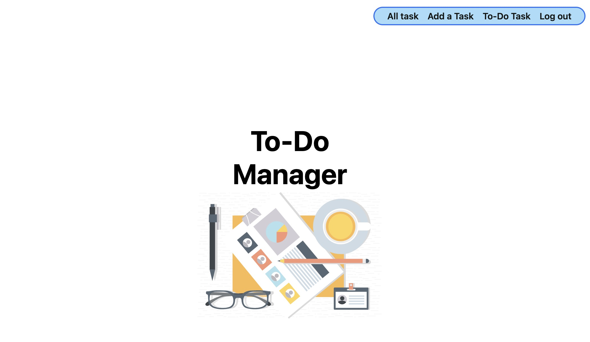

# To-Do Manager

---
## Intro to To-Do Manager
To-Do Manager is a robust and user-friendly web application designed to streamline task management and enhance productivity. With To-Do Manager, users can effortlessly organize their tasks, set priorities, and stay on top of their daily agendas. Whether you're a busy professional, a diligent student, or a proactive homemaker, To-Do Manager offers the perfect solution to efficiently manage your tasks.

## [Deployed Link](https://todo-manager.fly.dev/)
---
## Attributions 

* Image from [Vecteezy](https://www.vecteezy.com)

---
## Technologies used

---
## Ice Box 🧊
- [ ] Task Completion Tracking: allows users to track their task completion progress effortlessly. By marking tasks as completed, users can visualize their achievements and stay motivated to accomplish their goals.

- [ ] Task Categorization: For enhanced organization, offer the option to categorize tasks into different categories. users can categorize their tasks for better clarity and organization.

- [ ] Due Date Reminders: Users can set due dates for tasks and receive timely reminders to ensure timely completion and avoid procrastination.
